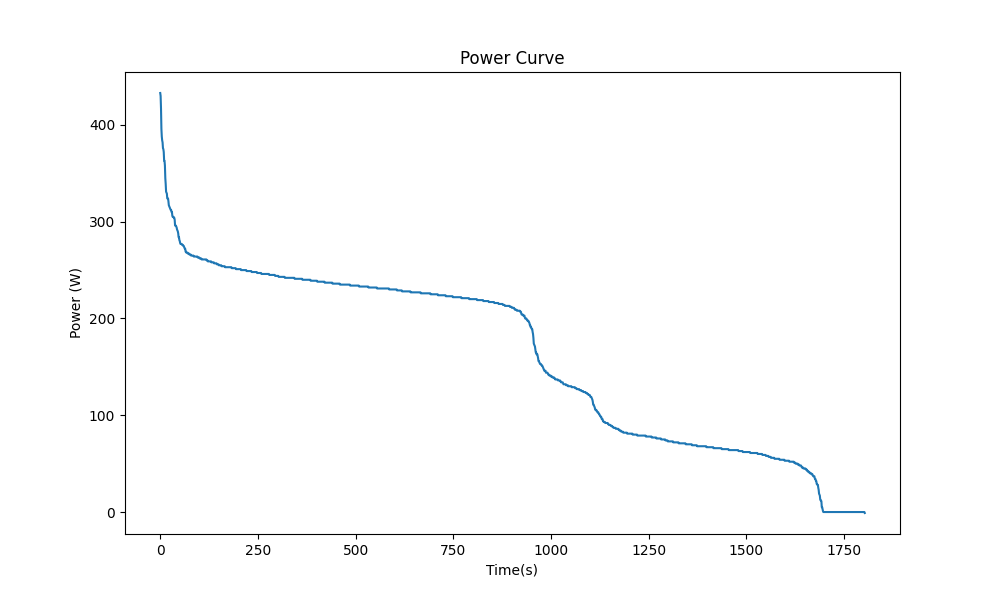

# PUE_Noah_Buder

## Projektübersicht 
Dieses Reposiroy liest gegebene Leistungsdaten aus einer CSV-Datei aus, sortiert diese und erstellt dann ein Leistungsdiagramm (Power Curve).

## Nutzung 
Damit der Code genutz werden kann muss zu erst das Repository geklont werden. 
Anschließend muss PDM mit 'pdm install' installiert werden. 

## Leistungsdiagramm
Nach dem sie sie das Skript ausgeführt haben finden sie das Leistungsdiagramm (Power Curve) unter 'figures/power_curve.png'.

## Beispielgrafik

